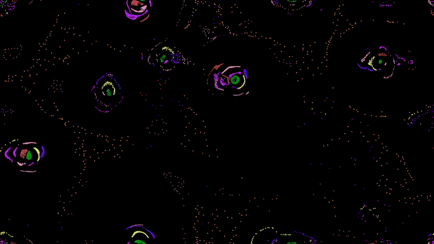
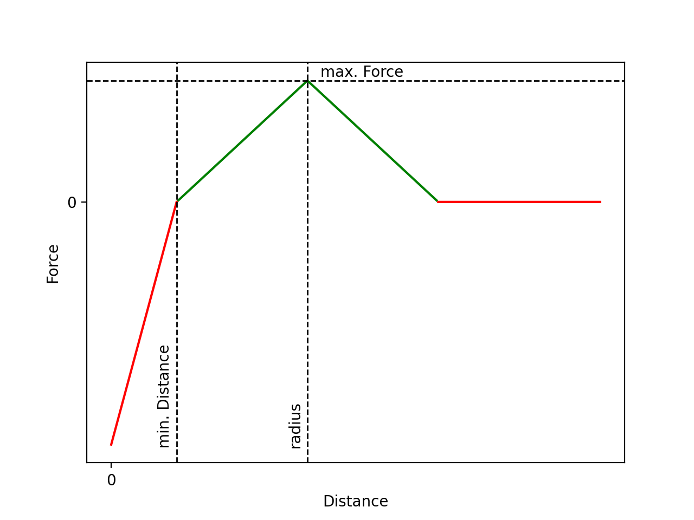
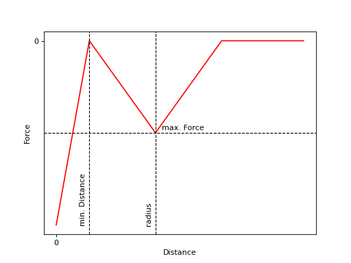

<h1 align="center">Particle Life</h1>
<div align="center">
    
</div>

<br />

<details>
    <summary>Table of Contents</summary>
    <ol>
        <li>
            <a href="#about-the-project">About The Project</a>
            <ul>
                <li>
                    <a href="#implementation-logic">Implementation Logic</a>
                    <ul>
                        <li>
                            <a href="#directional-force-matrix">Directional Force Matrix</a>
                        </li>
                        <li>
                            <a href="#relative-force-function">Relative Force Function</a>
                        </li>
                    </ul>
                </li>
            </ul>
        </li>
        <li>
            <a href="#getting-started">Getting Started</a>
            <ul>
                <li>
                    <a href="#prerequisites">Prerequisites</a>
                    <ul>
                        <li>
                            <a href="#linux">Linux</a>
                        </li>
                    </ul>
                </li>
                <li>
                    <a href="#building-the-project">Building the Project</a>
                    <ul>
                        <li>
                            <a href="#linux-1">Linux</a>
                        </li>
                    </ul>
                </li>
            </ul>
        </li>
        <li>
            <a href="#usage">Usage</a>
            <ul>
                <li>
                    <a href="#configuration">Configuration</a>
                </li>
                <li>
                    <a href="#run">Run</a>
                </li>
            </ul>
        </li>
    </ol>
</details>

## About The Project

This project is my own simple implementation of **Particle Life** by **Jeffrey Ventrella** and **Lynn Margulis** in C++ using **SFML** for rendering. A simple quadtree and a thread pool is implemented to optimize the performance of the update logic.

### Implementation Logic

Let $\mathbb{R}^{2n_{p}}$ be the vector space of our simulation at time $t$, where $n_{p}$ is the number of particles. This vector space defines every possible 2-dimenional position of every particle ($n_{p}$)  at time $t$.

We define

```math
\Psi_{t} := \begin{bmatrix}\psi_{t11} & \psi_{t12} \\ \vdots & \vdots \\ \psi_{tn_{p}1} & \psi_{tn_{p}2}\end{bmatrix} \in \mathbb{R}^{2n_{p}}
```

as the particle position matrix containing the position of every particle at time $t$ and

```math
$$N_{t} := \begin{bmatrix}\nu_{t11} & \nu_{t12} \\ \vdots & \vdots \\ \nu_{tn_{p}1} & \nu_{tn_{p}2}\end{bmatrix} \in \mathbb{R}^{2n_{p}}$$
```

as the particle velocity matrix containing the velocity of every particle at time $t$ used as a parameter to calculate the position matrix for the next time step $t+1$. To solve our simulation problem, we have to find $\Psi$ for every time step $t$ to obtain all particle positions. If we define $n_{f} \in \mathbb{N}^+ \setminus \{0, 1\}$ as the number of frames our simulation consists of, then $t \in [1, n_{f}]$. Therefore, we suppose $n_{f} = +\infty$ for real-time rendering if the user would never exit the program.

To obtain our particle positions, we have to consider two scenarios:

* $t = 1$ and
* $t > 1$

For $t = 1$ we set each entry of the particle position matrix to a uniformly distributed random number

```math
\psi_{1i1} \sim U(0, w)
```
```math
\psi_{1i2} \sim U(0, h)
```

and the particle velocity matrix to a null matrix

```math
N_{1} = \begin{bmatrix}0\end{bmatrix}_{2 \times n_{p}}
```

where $w \in \mathbb{R}^+$ is the width  and $h \in \mathbb{R}^+$ is the height of our observation field with its origin vector

$$\vec{\omega} := \begin{bmatrix}0 \\ 0\end{bmatrix}$$

and

$$i \in [1, n_{p}]$$

For $t > 1$ we have to define two functions:

```math
v: N_{t-1} \mapsto N_{t}
```
```math
p: (\Psi_{t-1}, N_{t}) \mapsto \Psi_{t}
```

where $v$ is the velocity function at time $t$ and $p$ is the position function at time $t$.

Let

```math
F_{t} := \begin{bmatrix}f_{t11} & f_{t12} \\ \vdots & \vdots \\ f_{tn_{p}1} & f_{tn_{p}2}\end{bmatrix} \in \mathbb{R}^{2n_{p}}
```

be the directional force matrix at time $t$ where each row $\vec{f_{ti}}$ represents the directional force vector applied to its corresponding particle position $\vec{\psi}_{ti-1}$. We describe the derivation of this directional force matrix just below ([Directional Force Matrix](#directional-force-matrix)).

We can calculate the particle velocity matrix at time $t$ now with

$$N_{t} = \mu N_{t-1} + \zeta F_{t}$$

where $\mu \in (0, 1)$ is defined as the friction and $\zeta \in \mathbb{R}$ is defined as the damping factor.

Further, the particle position matrix at time $t$ can now be calculated with

$$\Psi_{t} = \Psi_{t-1} + \delta N_{t}$$

where $\delta \in \mathbb{R}^+$ is defined as the time difference between two time steps.

#### Directional Force Matrix

Let $n(\vec{x}) = \frac{\vec{x}}{\lVert\vec{x}\rVert}, \forall \lVert \vec{x} \rVert \neq 0$.

To get the directional force matrix we firstly let

```math
\Delta_{t} := \begin{bmatrix}n(\vec{\Psi_{t1}} - \vec{\Psi_{t1}}) & \dots & n(\vec{\Psi_{tn_p}} - \vec{\Psi_{t1}}) \\ \vdots & \ddots & \vdots \\ n(\vec{\Psi_{t1}} - \vec{\Psi_{tn_p}}) & \dots & n(\vec{\Psi_{tn_p}} - \vec{\Psi_{tn_p}})\end{bmatrix}_{n_p \times n_p} \in \mathbb{R}^{2n_pn_p}
```

be the force direction matrix at time $t$ and

```math
\Phi_{t} := \begin{bmatrix}\phi_{t11} & \dots & \phi_{t1n_{p}}  \\ \vdots & \ddots & \vdots \\ \phi_{t_{n_p}1} & \dots & \phi_{n_pn_p}\end{bmatrix}_{n_p \times n_p} \in \mathbb{R}^{n_pn_p}
```

be the uncumulated force matrix at time $t$ where each $\phi_{tij}$ is defined as the force that particle $j \in [1, n_p]$ exerts on particle $i \in [1, n_p]$ at time $t$ which is determined by the function $\lVert \vec{\Psi_{tj}} - \vec{\Psi_{ti}} \rVert \mapsto \phi_{tij}$ that maps the distance between the two particle positions onto the relative force. We describe the relative force function below ([Relative Force Function](#relative-force-function)).

We define

```math
P_t := \Delta_t \odot \Phi_t \in \mathbb{R}^{2n_pn_p}
```

as the uncumulated directional force matrix. It is the Hadamard Product of the force direction matrix and the uncumulated force matrix.

Lastly, to get the (cumulated) directional force matrix we define

```math
F_t := \begin{bmatrix} \sum_{j \in [1, n_p]} \vec{P_{t1j}} \\ \vdots \\ \sum_{j \in [1, n_p]} \vec{P_{tn_pj}} \end{bmatrix} \in \mathbb{R}^{2n_p}
```

#### Relative Force Function

We define the relative force function as the map

```math
f: \lVert \vec{\Psi_{tj}} - \vec{\Psi_{ti}} \rVert \mapsto \phi_{tij}
```

where the magnitude of the vector pointing from the position of particle $i \in [1, n_p]$ to the position of particle $j \in [1, n_p]$ is mapped onto the relative force.

To formulate the function, we first define the parameter

```math
d_{tij} := \lVert \vec{\Psi_{tj}} - \vec{\Psi_{ti}} \rVert
```

as the actual distance between particle $i$ and particle $j$ at time $t$ and

```math
m_{ij} \in \mathbb{R} \setminus \{0\}
```

as the minimum distance particle $i$ is rejecting particle $j$ with a repulsive force and

```math
k_{ij} \in \mathbb{R}
```

as the maximum force with whose particle $i$ is attracted to particle $j$ and

```math
r_{ij} \in \mathbb{R} \setminus \{0\}
```

as the radius at which

```math
f(d_{ij}) = k_{ij}
```

and

```math
a \in \mathbb{R}^+
```

as the repulsive force factor and

```math
q_{ij} := -\lvert ak_{ij} \rvert \in \mathbb{R}^{-}
```

as the maximum repulsive force particle $j$ exerts on particle $i$.

With these parameters the function can now be expressed as:

```math
f(d_{ij}, m_{ij}, r_{ij}, k_{ij}, q_{ij}) = \Biggl\{ \begin{array}{ll} -\frac{q_{ij}}{m_{ij}}d_{ij} + q_{ij} & \text{ if } d_{ij} \le m_{ij} \\ \frac{k_{ij}}{r_{ij} - m_{ij}}d_{ij} - \frac{k_{ij}m_{ij}}{r_{ij} - m_{ij}} & \text{ if } d_{ij} > m_{ij} \wedge d_{ij} \le r_{ij} \\ -\frac{k_{ij}}{2r_{ij} - m_{ij}} + k_{ij} & \text{ if } d_{ij} > r_{ij}i \wedge d_{ij} \le 2r_{ij} - m_{ij} \\ 0 & \text{ else } \end{array}
```

The graph of this function looks as follows for $k_{ij} \in \mathbb{R}^+$:

<div align="center">
    
</div>

and for $k_{ij} \in \mathbb{R}^-$:

<div align="center">
    
</div>

## Getting started

### Prerequisites

#### Linux

* A **cmake** version of **3.22** or greater is required.
* You need to have **boost 1.82 or later** installed on your system. You can find it [here](https://www.boost.org/).
* You also need to have **SFML** installed on your system. You can find it in your distro repos or [here](https://www.sfml-dev.org/download/sfml/2.6.1/).

### Building The Project

#### Linux

* Clone this repository to your local machine using `git clone https://github.com/jaju0/particle-life.git`.
* Navigate to the project directory using `cd particle-life`.
* Run the configure.sh script to call cmake and generate the necessary files for building the project. You can use `./configure.sh` or `sh configure.sh`.
* Run the build.sh script to build the project using make. You can use `./build.sh` or `sh build.sh`.
* You should see a `particle_life` executable file in the dist directory. You can run it using `./run.sh` or `./dist/particle_life`.

## Usage

### Configuration

* There is a `config.ini` file in the root directory. It will be copied to the build directory `dist/` automatically on build.
* The config file has the following properties:

| name | description |
|:-----|:------|
| window.width | width of window $w$ |
| window.height | height of window $h$ |
| window.fullscreen | set window in fullscreen mode |
| particle.particle_spawner_type | `random_uniform` or `random_normal` |
| particle.number_of_types | number of randomly generated particle types |
| particle.force_distribution_min_value | min. value of uniform max. force $k_{ij}$ distribution. |
| particle.force_distribution_max_value | max. value of uniform force $k_{ij}$ distribution. |
| particle.radii_distribution_min_value | Min. value of uniform radii $r_{ij}$ distribution. It is used to get a random interaction radius between two particle types. |
| particle.radii_distribution_max_value | Max. value of uniform radii $r_{ij}$ distribution. |
| particle.minDistance_distribution_min_value | Min. value of uniform min. distance $m_{ij}$ distribution. The distribution is used to get a random min. distance for the repulsive force between two particle types. |
| particle.minDistance_distribution_max_value | Max. value of uniform min. distance $m_{ij}$ distribution. |
| particle.repulsive_force_multiplier | Force coefficient $a$ for the repulsive force value $q_{ij}$ |
| particle.number_of_particles | Number of particles to spawn $n_p$. |
| particle.shape_radius | Radius of the circle rendered to the window. |
| particle.speed | Simulated time duration $\delta$ between two updates. |

### Run

* Run the executable with `./run.sh`.
* You can change the path to the config file with `./run.sh --config path-to-config-file`.
